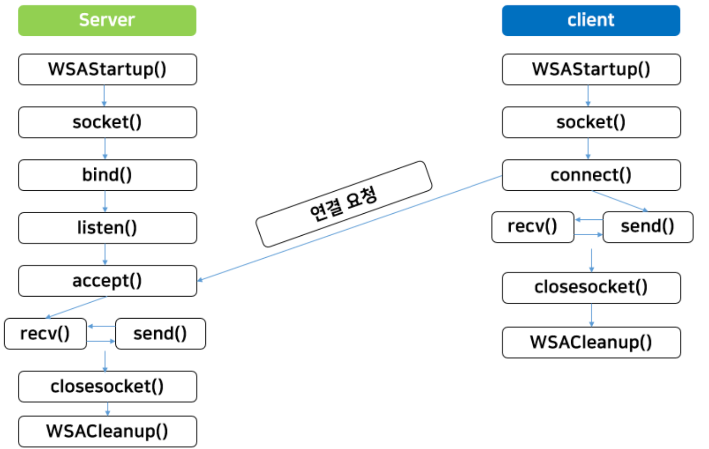

## Socket Program

소켓 : 콘센트 등으로 볼 수도 있겠다. 일반적인 장치가 전기를 공급받기 위해 전원과 연결하는 수단이 되는데, 프로그래밍에서도 비슷한 뜻을 가진다. 클라이언트의 프로그램에서 네트워크 환경(서버)에 연결할 수 있도록 만들어진 연결부를 뜻한다.

소켓은 IP 주소와 Port 번호로 구성된다. 서버는 상시 클라이언트를 받아들일 준비를 해야 하며, 포트 번호를 통해 어떤 연결을 요청하는지(클라이언트가 서버의 소켓 중 어디에 꼽을지)를 결정한다.

### 서버

서버 기준의 작동은 다음과 같다.

소켓 생성 - 소켓 결합(bind) - 클라이언트 요청 대기(listen) - 클라이언트 연결 수락 - 데이터 송수신 - 소켓 닫기

bind의 경우에는, 소켓과 포트 번호를 결합하는 것이다. 소켓들이 중복된 포트 번호를 사용하지 않도록, 특정 포트 번호를 서버 소켓이 사용하도록 만들기 위해 결합하는 과정이다.

### 클라이언트

클라이언트 기준의 작동은 다음과 같다.

소켓 생성 - 서버에 연결 요청 - 데이터 송수신 - 소켓 닫기

서버의 작동 대비 직관적이고 간단하다.

## 포트포워딩

소켓 프로그래밍에서 그리 중요한 내용은 아니지만, 필요한 내용이기에 정리한다.

공유기에서 할당한 내부 IP는 같은 공유기를 사용하는 기기끼리만 통용되는 주소이다.

마치 같은 아파트에 사는 사람들이라면 '110동 303호'라고만 말해도 알 수 있는 것처럼

그러나 외부인에게 알려줘야 하는 공인 주소는 대한민국 "OO시 OO구 OO아파트"로 구성된다. 중요한 점은, 공인 주소에는 "110동 303호"와 같은 정보는 들어있지 않다는 점. ('아파트'라는 공유기에 공인 아이피 1개가 배정될 뿐이다)

때문에 외부에서 기기에 접속하려면 외부 IP 주소가 필요하며, 이는 전세계에서 해당 기기에게만 부여되는 진짜 주소이다.

포트Port는 해당 주소로 이동했을 때, 연결할 통로를 뜻한다.

대강 OO아파트 110동 303호의 '몇 번 방으로' 정보를 전달할지에 대한 내용이라고 보면 될 듯.

따라서 적절한 데이터는 [공인 주소:포트 번호]의 형식으로 송신된다. 다만 문제가 하나 있다.

위의 예시에 따르면, [공인 주소:포트 번호]의 구조는 결국 "OO시 OO구 OO아파트 XX번 방"이 된다. 몇동 몇호의 집인지는 모른다는 말이다.(가령 80번 방을 열어둔 가정이 한둘이 아닐 수 있다는 것.)

포트포워딩은 이러한 부분에 있어 교통정리를 해준다. 외부에서 특정 아파트의 XX번 방에 요청하면, 아파트 경비실에서 110동 203호의 YY번 방을 호출해주는 것. 이러한 mapping 작업을 포트포워딩이라 한다.

포트포워딩 설정의 예시. 아파트의 23456번 방을 요청받으면, 117호실의 12345번 방을 호출하도록 설정함.

소켓 프로그래밍과 포트포워딩을 이용한 채팅 프로그램 예제. 포트포워딩 정보가 그대로 반영된 것을 확인 가능함.

