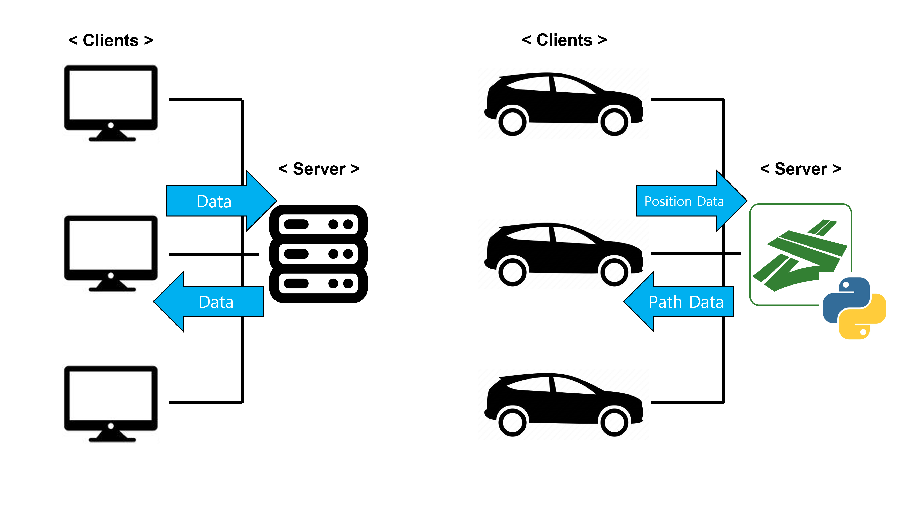

## 포트

디바이스 주소를 표현할 때 127.0.0.1:12345와 같이, IP 주소와 포트 번호를 같이 쓴다. IP 주소가 네트워크 상 특정 장치를 식별하는 역할을 한다면, 포트는 그 장치 내 특정 서비스로 연결시켜주는 역할을 한다.

소켓 프로그래밍 상에서, 서버측 포트는 보통 클라이언트 수신용으로 하나의 고정된 포트를 사용한다.

클라이언트측 포트는 서버에 요청을 보낼 때 임의의 포트를 사용한다. 임의의 포트는 OS에 의해 자동으로 할당된다.

## PID

OS에서 각 프로세스를 고유하게 식별하는 번호. 리소스 할당을 포함한 프로세스 관리를 위해 사용된다.

포트 번호와 언뜻 같다고 볼 수도 있지만, 포트는 네트워크 요청을 받아들이기 위한 일종의 창구이다. 모든 프로세스는 PID를 가지며, 이 중 네트워크 통신이 필요한 프로세스(PID)가 특정 포트를 사용(mapping)하고 있다고 볼 수 있다.

소켓은 특정 포트와 연관되며, 이 소켓을 생성한 프로세스는 고유의 PID를 가진다.

## 멀티스레딩

하나의 프로세스 내에서 여러 스레드를 동시에 실행하는 기술. 서버 및 애플리케이션이 동시에 여러 작업을 처리할 수 있도록 한다.

네트워크 서버에서 여러 클라이언트의 요청을 동시에 처리하는 것이 대표적이다. 각 클라이언트 연결은 독립된 스레드에서 처리되므로 클라이언트 서로간에 영향을 미치지 않는다.

서버는 단일 포트에서 다중 클라이언트 요청을 받아들이며, 각 연결이 수신될 때마다 별도의 스레드에서 이를 처리한다. 스레드에서는 새로운 소켓 객체가 생성되고 클라이언트와의 통신을 담당한다.

## 소켓 프로그래밍을 이용한 SUMO TraCI 작동

교통 시뮬레이터 SUMO는 TraCI를 통해 Python 환경에서 여러 조작(set) 및 정보 수집(get)을 할 수 있다. 이를 통해 차량의 위치 혹은 경로를 파악하고 조정할 수 있다. 이 모든 것은 시뮬레이터 내부에서 작동 가능하지만, 실제 상황에서 이런 작동은 불가능하다. 그래서 서버-클라이언트 구조를 활용해 클라이언트(edge) 부분에서는 SUMO(주어진 경로로 이동하는 작동)만, 서버 부분에서는 TraCI(현재 map의 정보를 받아서 차량들의 경로를 조정)만 맡도록 한다. 서버가 일종의 차량 간 중재자가 되는 것이라고도 볼 수 있다.

대신 지금은 차량이 있는 것도 아니고, 클라이언트 역할을 하는 디바이스도 많지 않기 때문에 하나의 디바이스에서 여러 소켓을 만들어 차량 개수만큼의 클라이언트가 서버에 연결하는 효과를 볼 것이다.

이 구조에서 쟁점은 다음과 같다 : 수천 수만대의 차량(클라이언트)가 서버에 접속할 때, 서버가 과부하되지 않도록 하는 것. 과부하까지는 아니더라도, 가능한 효율적으로 클라이언트를 관리하는 것을 목적으로 해야 할 것이다.

+ 클라이언트가 전달해야 할 정보 : Position, Route?
+ 서버가 미리 갖고 있어야 하는 정보 : Net(Edges), 각 edge의 Weight
+ 서버가 전달해야 할 정보 : 각 Vehicle의 최적화된 Route
+ 움직이지 않는 vehicle들은 굳이 데이터를 주고받을 필요가 없다?
+ Position이 변화하지 않는다는 정보 자체가 중요할 수 있다

혹은 :

+ 클라이언트가 전달해야 할 정보 : Route
+ 서버가 미리 갖고 있어야 하는 정보 : Net
+ 서버가 전달해야 할 정보 : 예상되는 Route에 대해 예상되는 Edge들의 Weight (서버 연산량이 꽤 있긴 할듯)
+ 난이도적으로 보면 이게 더 쉬울것같긴 하네

현재 단일 TraCI에서는 RouteFreq마다...

+ 각 Edge의 Effort를 초기화
+ 각 Vehicle의 Lane, Position, Speed, Route 정보를 추출해 Route를 최적화

